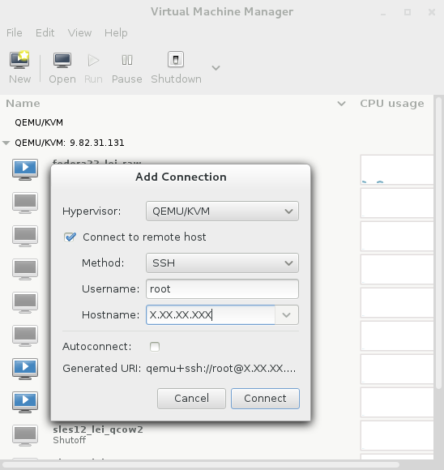
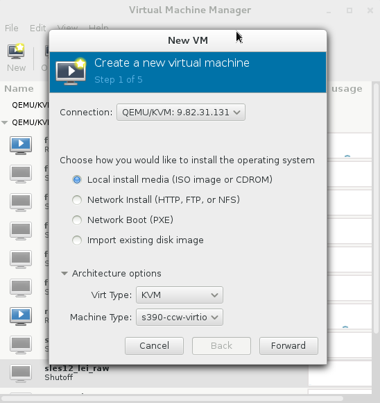
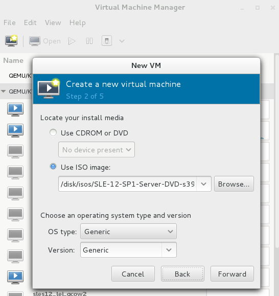
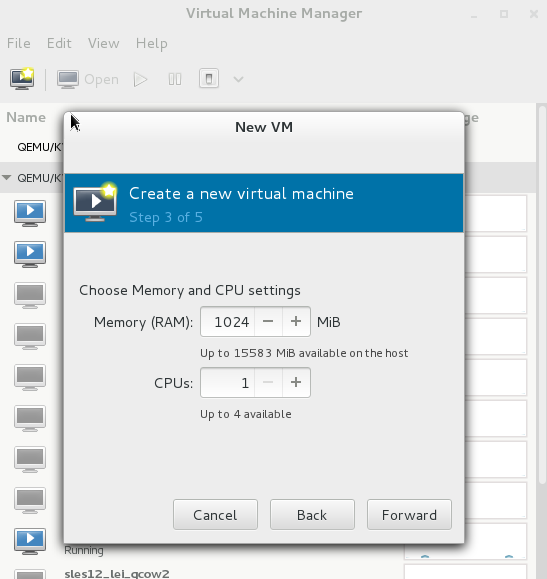
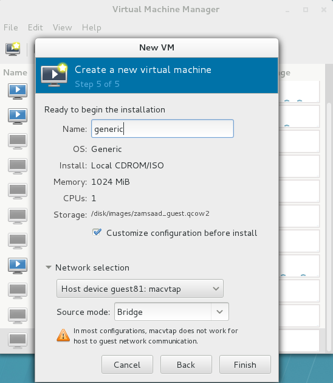
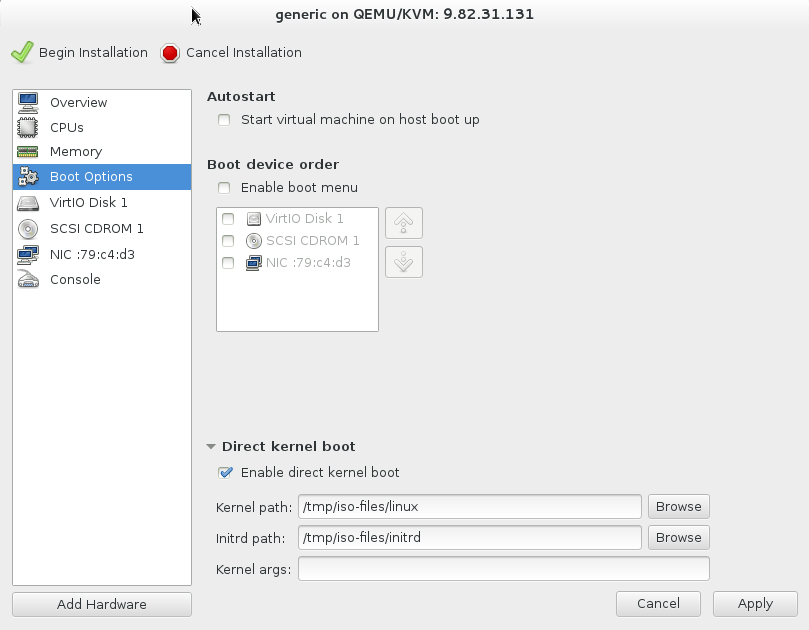
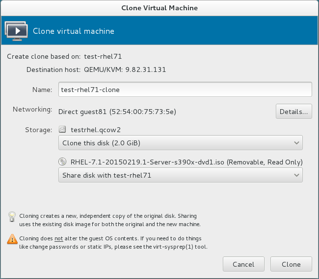

[KVM for IBM z Systems](http://www-03.ibm.com/systems/z/solutions/virtualization/kvm/) became generally available in September 2015. [virt-manager](https://virt-manager.org/) (which is based on the [libvirt](http://libvirt.org/) API) is a popular GUI application for creating and managing KVM guests. Thanks to recent effort by the virt-manager community, the latest version now has the functionality to create and destroy guests running on KVM on z.

The following instructions show how to build virt-manager on an x86-64 system, and how to use it to connect to a KVM hypervisor running on IBM z Systems, and manage its guests. These instructions have been tested on RHEL 7.1 and SLES 12.1 on x86-64.

## Building virt-manager

1. Install prerequisites for virt-manager (as root):

    (RHEL 7.1)

        $ sudo yum groupinstall 'X Window System' 'GNOME'
        $ sudo yum install git libosinfo libvirt-python libvirt-glib openssh-askpass \
               python-ipaddr spice-gtk-python spice-gtk3

    (SLES 12.1)

        $ sudo zypper install gtk-vnc2-devel intltool libvirt-python libvirt-glib-devel \
               libosinfo libosinfo-devel openssh-askpass-gnome python-libxml2 python-gtk-devel \
               python-gtk-vnc python-ipaddr python-requests spice-gtk-devel vte2-devel python-vte

1. Clone the virt-manager source code from GitHub, and build it:

        $ git clone https://github.com/virt-manager/virt-manager.git
        $ cd virt-manager
        $ python setup.py build
        $ sudo python setup.py install

    This will install the latest version of virt-manager from its GitHub repository and all the data files that it needs under /usr/bin/ and /usr/share/.

1. The previous step installed a new GSettings schema named 'org.virt-manager.virt-manager', which must be compiled into the schema cache before use:

        $ sudo glib-compile-schemas --strict /usr/share/glib-2.0/schemas

1. **(Optional)** Run the self-verifying tests that come with virt-manager:

        $ sudo rm -f /tmp/virtinst-.treeinfo.
        $ python setup.py test

   Note that the tests will produce a file named "virtinst-.treeinfo." in the /tmp/ directory. If the file already exists (from a previous test run), it must be deleted before attempting the tests.

## Managing guests on a remote KVM hypervisor running on IBM z Systems

### Connecting to the KVM hypervisor

1. **(Optional)** virt-manager will invoke the [gnome-ssh-askpass](http://manpages.ubuntu.com/manpages/hardy/man1/gnome-ssh-askpass.1.html) utility to prompt for a SSH passphrase for the remote system interactively. Before starting virt-manager, [generate a pair of SSH keys](https://help.github.com/articles/generating-ssh-keys/) and copy the public key into the file `~root/.ssh/authorized_keys` on the KVM hypervisor. You can use a key without a passphrase to streamline the login process, but doing so has security implications and is not recommended for production systems.

   If you do not use SSH public key authentication, SSH will prompt for a password in the terminal. For this to work, you must invoke virt-manager with the `--no-fork` option.

1. Launch virt-manager in a terminal or open it through the application menu:

        $ virt-manager [--no-fork]

1. To create a connection to the KVM hypervisor, open the File menu and choose "Add Connection". Select the option to "Connect to remote host", choose the "SSH" connection method, fill out the username and hostname fields, and then click "Connect".

   

   After connecting to the hypervisor, all available guests will be listed in the virt-manager window.

### Creating a new virtual machine

1. To install a Linux guest from an ISO image on the KVM server, you need to mount the ISO image, extract the kernel and initrd files from it, and place them in a temporary location. The following example is for copying the files from a SLES 12 SP1 ISO image:

        # mkdir /tmp/iso-files
        # mount -o ro,loop /disk/isos/SLE-12-SP1-Server-DVD-s390x-DVD1.iso /mnt
        # cd /mnt/boot/s390x
        # cp ./linux ./initrd /tmp/iso-files
        # cd /tmp/iso-files
        # chmod 755 linux initrd
        # umount /mnt

   The following is an example for copying the files from a RHEL 7.1 ISO image:

        # mkdir /tmp/iso-files
        # mount -o ro,loop /disk/isos/RHEL-7.1-20150219.1-Server-s390x-dvd1.iso /mnt
        # cd /mnt/images
        # cp ./kernel.img ./initrd.img /tmp/iso-files
        # cd /tmp/iso-files
        # chmod 755 kernel.img initrd.img
        # umount /mnt

1. Create a new virtual machine by clicking the "New" button in virt-manager. This will bring up the "New VM" dialog box. Ensure that you are connected to the correct KVM hypervisor as shown in the "Connection" drop-down menu. Select "Local install media (ISO image or CDROM)". Within the architecture options, ensure that "Virt Type" is set to "KVM" and "Machine Type" is set to "s390-ccw-virtio". Click "Forward".

   

1. Browse and select the ISO image to install from. The OS type and version can be specified if matched with the ISO or left as "Generic". Click "Forward".

   

1. Select the amount of RAM and CPUs to allocate to the virtual machine. Click "Forward".

   

1. Enter a name and size for the disk storage for the virtual machine. Click "Forward".

1. Enter a name for the guest VM, and select the checkbox to "Customize configuration before install". Expand the "Network selection" section and choose the network device on the hypervisor with which the VM should be bridged. Typically this will be a [macvtap](http://virt.kernelnewbies.org/MacVTap) device. Set the "Source mode" to "Bridge". Click "Finish" to close this dialog box and open the VM configuration window.

   

1. In the VM configuration window, select "Boot Options" from the menu on the left, then expand the "Direct kernel boot" section and select "Enable direct kernel boot". In the "Kernel path" field, Enter the path to the extracted kernel file, e.g. `/tmp/iso-files/linux`. Similarly, in the "Initrd path" field, enter the path to the extracted initrd file, e.g. `/tmp/iso-files/initrd`. Click "Apply", then click "Begin Installation".

   

1. The console window to the new VM will open after a brief pause, and the installation of the guest operating system will begin. After completing the installation, the installer will typically reboot the system. The reboot will use the direct kernel boot parameters again instead of booting into the newly installed guest. To change the boot options, shut down the VM by clicking "Shut Down" in the console window, click "Details", navigate to the "Boot Options" menu, and uncheck the "Enable direct kernel boot" option.

1. Restart the virtual machine. The guest operating system should boot up correctly.

### Cloning a virtual machine

1. An easy way to create more virtual machines is to clone an existing one. Before cloning a virtual machine, make sure that it is not running (in the "Shutoff" state). In the virt-manager window, right-click on the virtual machine, and choose "Clone" to bring up the "Clone Virtual Machine" dialog box.

   

1. By default, the name of the new clone is the same as the original virtual machine, with a "-clone" suffix. Change this name if desired. Click the "Clone" button to begin cloning. Once the cloning completes, a second instance of the virtual machine will appear in the virt-manager window. Both guests (old and new) can be started and should boot up correctly.

   

1. **(Optional)** By default, the original disk image will be copied to a new image file with a "-clone" suffix, e.g. _originalimage_-clone.qcow2. This name is not modifiable. However, after the cloning is complete, with the clone in "Shutoff" state, the cloned disk image can be renamed on the hypervisor (e.g. `mv testrhel-clone.qcow2 testrhel2.qcow2`), and then the virtual storage device can be removed from the clone, and re-added using the new file name.

### References

* [Creating and Managing Guests with Virt-Manager](https://docs.fedoraproject.org/en-US/Fedora/23/html/Virtualization_Getting_Started_Guide/ch06.html)
* [Managing VMs with the Virtual Machine Manager](http://www.ibm.com/developerworks/cloud/library/cl-managingvms/)

## Building libvirt (Optional)

You do not need a new version of libvirt if you only want to use virt-manager to manage KVM guests on IBM z Systems, but in case you would like to update libvirt to the latest and greatest version (for new bug fixes, for example), the following steps show how to build and install libvirt.

1. Install libvirt dependencies (as root):

    (RHEL 7.1)

        $ sudo yum install audit-libs-devel augeas avahi-devel dbus-devel \
               device-mapper-devel ebtables fuse-devel git glusterfs-api-devel \
               glusterfs-devel gnutls-devel libattr-devel libblkid-devel \
               libcap-ng-devel libcurl-devel libnl3-devel libnl-devel \
               libpcap-devel libpciaccess-devel librados2-devel librbd1-devel \
               libselinux-devel libtasn1-devel libvirt-gconfig libvirt-glib \
               libvirt-gobject libvirt-python libxml2-devel ncurses-devel \
               netcf-devel numactl-devel numad parted-devel perl polkit-devel \
               python-requests qemu-img qemu-kvm readline-devel sanlock-devel \
               scrub systemd-devel xhtml1-dtds yajl-devel

    (SLES 12)

        $ sudo zypper install audit-devel augeas bridge-utils cyrus-sasl-devel \
               device-mapper-devel dnsmasq ebtables fuse-devel gnutls intltool \
               libapparmor-devel libattr-devel libavahi-devel libblkid-devel \
               libcap-ng-devel libcurl-devel libgcrypt-devel libgnutls-devel \
               libnetcontrol-devel libnl3-devel libnuma-devel libpcap-devel \
               libpciaccess0-devel libselinux-devel libssh2-devel libtasn1-devel \
               libudev-devel libvirt-python libxml2-devel libyajl-devel lzop \
               numad qemu-tools openssh-askpass-gnome parted-devel polkit-devel \
               python-libxml2 python-requests python-vte qemu radvd \
               readline-devel sanlock sanlock-devel systemd-devel \
               typelib-1_0-GtkVnc-2_0 virtualbox xen xen-devel xhtml-dtd

1. Download the latest libvirt source RPM and rebuild it:

    (RHEL 7.1)

        $ wget ftp://libvirt.org/libvirt/libvirt-1.2.20-1.fc22.src.rpm
        $ rpmbuild --rebuild libvirt-1.2.20-1.fc22.src.rpm

    (SLES 12)

        $ wget http://download.opensuse.org/repositories/Virtualization/SLE_12/src/libvirt-1.2.21-539.1.src.rpm
        $ rpmbuild --rebuild libvirt-1.2.21-539.1.src.rpm

   The build process will also perform a number of sanity tests on the libvirt binaries. There should be no failures.

1. The binary RPMs will be created in $HOME/rpmbuild/RPMS/x86_64/. Run `rpm -Uvh` as root to install libvirt (or upgrade it, if there is already an existing installation on the system):

    (RHEL 7.1)

        $ cd $HOME/rpmbuild/RPMS/x86_64
        $ sudo rpm -Uvh libvirt-1.2.20-1.el7.x86_64.rpm \
                        libvirt-client-1.2.20-1.el7.x86_64.rpm \
                        libvirt-daemon-1.2.20-1.el7.x86_64.rpm \
                        libvirt-daemon-config-network-1.2.20-1.el7.x86_64.rpm \
                        libvirt-daemon-config-nwfilter-1.2.20-1.el7.x86_64.rpm \
                        libvirt-daemon-driver-interface-1.2.20-1.el7.x86_64.rpm \
                        libvirt-daemon-driver-lxc-1.2.20-1.el7.x86_64.rpm \
                        libvirt-daemon-driver-network-1.2.20-1.el7.x86_64.rpm \
                        libvirt-daemon-driver-nodedev-1.2.20-1.el7.x86_64.rpm \
                        libvirt-daemon-driver-nwfilter-1.2.20-1.el7.x86_64.rpm \
                        libvirt-daemon-driver-qemu-1.2.20-1.el7.x86_64.rpm \
                        libvirt-daemon-driver-secret-1.2.20-1.el7.x86_64.rpm \
                        libvirt-daemon-driver-storage-1.2.20-1.el7.x86_64.rpm \
                        libvirt-daemon-kvm-1.2.20-1.el7.x86_64.rpm

    (SLES 12)

        $ cd /usr/src/packages/RPMS/x86_64/
        $ sudo rpm -Uvh libvirt-1.2.21-539.1.x86_64.rpm \
                        libvirt-client-1.2.21-539.1.x86_64.rpm \
                        libvirt-daemon-1.2.21-539.1.x86_64.rpm \
                        libvirt-daemon-config-network-1.2.21-539.1.x86_64.rpm \
                        libvirt-daemon-config-nwfilter-1.2.21-539.1.x86_64.rpm \
                        libvirt-daemon-driver-interface-1.2.21-539.1.x86_64.rpm \
                        libvirt-daemon-driver-libxl-1.2.21-539.1.x86_64.rpm \
                        libvirt-daemon-driver-lxc-1.2.21-539.1.x86_64.rpm \
                        libvirt-daemon-driver-network-1.2.21-539.1.x86_64.rpm \
                        libvirt-daemon-driver-nodedev-1.2.21-539.1.x86_64.rpm \
                        libvirt-daemon-driver-nwfilter-1.2.21-539.1.x86_64.rpm \
                        libvirt-daemon-driver-qemu-1.2.21-539.1.x86_64.rpm \
                        libvirt-daemon-driver-secret-1.2.21-539.1.x86_64.rpm \
                        libvirt-daemon-driver-storage-1.2.21-539.1.x86_64.rpm \
                        libvirt-daemon-driver-uml-1.2.21-539.1.x86_64.rpm \
                        libvirt-daemon-driver-vbox-1.2.21-539.1.x86_64.rpm \
                        libvirt-daemon-lxc-1.2.21-539.1.x86_64.rpm \
                        libvirt-daemon-qemu-1.2.21-539.1.x86_64.rpm

        $ sudo rpm -Uvh libvirt-daemon-uml-1.2.21-539.1.x86_64.rpm \
                        libvirt-daemon-xen-1.2.21-539.1.x86_64.rpm \
                        libvirt-devel-1.2.21-539.1.x86_64.rpm \
                        libvirt-doc-1.2.21-539.1.x86_64.rpm \
                        libvirt-lock-sanlock-1.2.21-539.1.x86_64.rpm

   Upgrading libvirt should preserve existing libvirt data and configuration files. You may want to examine the configuration files and compare them with the versions saved by `rpm` (\*.rpmsave), to ensure that their contents are still correct.

1. **(Optional)** Restart the libvirt daemon:

        $ sudo service libvirtd restart
